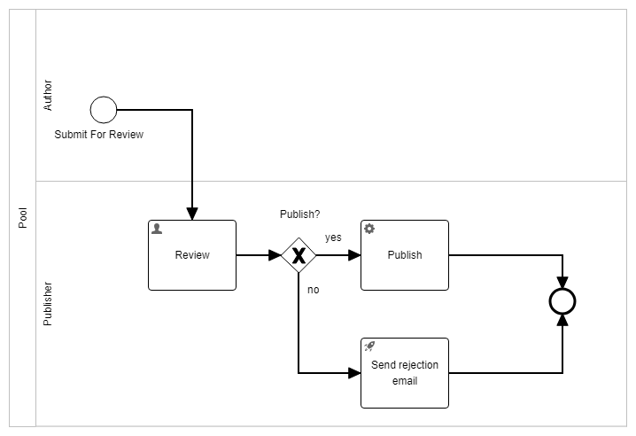

## flowable-poc

This is POC for flowable: simple Article Approval Flow with few standard BMPN 2.0/Flowable elements:

Also see src/main/resources/processes/approvalTest.bpmn

To see in action (look at the logs):

1. Run DB: docker compose -f docker-compose-db.yml up
2. Run Application 

3. Submit Task:\
curl --location 'localhost:8080/submit' \
   --header 'Content-Type: application/json' \
   --data '{
   "author": "SomeAuthor",
   "url": "someUrl"
   }'

3. See all tasks:\
curl --location 'localhost:8080/tasks' \
   --data ''

4. Submit Review:\
   - To Publish:\
   curl --location 'localhost:8080/review' \
     --header 'Content-Type: application/json' \
     --data '{
     "taskId": "id you see in step 3.",
     "status": true
     }'
   - To Send Rejection email:\
   curl --location 'localhost:8080/review' \
      --header 'Content-Type: application/json' \
      --data '{
      "taskId": "id you see in step 3.",
      "status": true
      }'

Flowable Spring Actuator endpoint:\
curl --location 'localhost:8080/actuator/flowable'